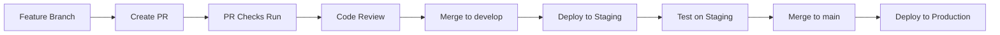

# HumanGlue Platform - Deployment Guide

Complete guide for deploying the HumanGlue platform to production and staging environments.

## Table of Contents

- [Overview](#overview)
- [Prerequisites](#prerequisites)
- [Environment Setup](#environment-setup)
- [First-Time Deployment](#first-time-deployment)
- [Routine Deployments](#routine-deployments)
- [Database Migrations](#database-migrations)
- [Monitoring](#monitoring)
- [Rollback Procedures](#rollback-procedures)
- [Troubleshooting](#troubleshooting)

## Overview

### Architecture

- **Platform**: Netlify
- **Framework**: Next.js 14 (App Router)
- **Database**: Supabase (PostgreSQL)
- **CDN**: Netlify Edge Network
- **Functions**: Netlify Serverless Functions
- **CI/CD**: GitHub Actions

### Environments

| Environment | Branch | URL | Purpose |
|-------------|--------|-----|---------|
| **Production** | `main` | https://humanglue.ai | Live user-facing site |
| **Staging** | `develop` | https://staging.humanglue.ai | Pre-production testing |
| **Preview** | Pull Requests | Dynamic | Code review and testing |
| **Development** | Local | http://localhost:5040 | Local development |

## Prerequisites

### Required Accounts

1. **GitHub** - Source code repository
2. **Netlify** - Hosting platform
3. **Supabase** - Database and authentication
4. **Sentry** (optional) - Error tracking
5. **Stripe** (optional) - Payment processing

### Required Tools

Install the following tools:

```bash
# Node.js 20+
node --version  # Should be 20.x

# Netlify CLI
npm install -g netlify-cli
netlify --version

# Supabase CLI
npm install -g supabase
supabase --version

# Git
git --version
```

### Required Credentials

Gather the following credentials:

- **Supabase**:
  - Project URL
  - Anonymous (public) key
  - Service role key (server-side only)
  - Database connection string

- **Netlify**:
  - Site ID
  - Personal access token
  - Build hook URL (optional)

- **GitHub**:
  - Personal access token (for CI/CD)
  - Repository access

## Environment Setup

### 1. Netlify Configuration

#### Create New Site

```bash
# Login to Netlify
netlify login

# Link to existing site or create new
netlify link

# Or create new site
netlify sites:create --name humanglue
```

#### Configure Build Settings

In Netlify dashboard:

1. Go to **Site settings** → **Build & deploy**
2. Set build command: `npm run build`
3. Set publish directory: `.next`
4. Set Node version: `20`

### 2. Environment Variables

#### Staging Environment

Set these in Netlify dashboard under **Site settings** → **Environment variables**:

```bash
# Application
NEXT_PUBLIC_ENV=staging
NEXT_PUBLIC_SITE_URL=https://staging.humanglue.ai
NODE_ENV=production

# Supabase (Staging)
NEXT_PUBLIC_SUPABASE_URL=https://your-staging-project.supabase.co
NEXT_PUBLIC_SUPABASE_ANON_KEY=eyJhbGciOiJIUzI1NiIsInR5cCI6IkpXVCJ9...
SUPABASE_SERVICE_ROLE_KEY=eyJhbGciOiJIUzI1NiIsInR5cCI6IkpXVCJ9...
SUPABASE_STAGING_DB_URL=postgresql://...

# Rate Limiting (Upstash Redis)
UPSTASH_REDIS_REST_URL=https://...
UPSTASH_REDIS_REST_TOKEN=...

# AI Providers
GOOGLE_AI_API_KEY=...
OPENAI_API_KEY=...
ANTHROPIC_API_KEY=...

# Email
RESEND_API_KEY=re_...

# Stripe (Test Mode)
NEXT_PUBLIC_STRIPE_PUBLISHABLE_KEY=pk_test_...
STRIPE_SECRET_KEY=sk_test_...
STRIPE_WEBHOOK_SECRET=whsec_...

# Error Tracking
NEXT_PUBLIC_SENTRY_DSN=https://...
SENTRY_AUTH_TOKEN=...

# Analytics
NEXT_PUBLIC_GA_MEASUREMENT_ID=G-...
NEXT_PUBLIC_ENABLE_ANALYTICS=true
```

#### Production Environment

Use the same variable names but with production values:

```bash
NEXT_PUBLIC_ENV=production
NEXT_PUBLIC_SITE_URL=https://humanglue.ai

# Use production Supabase project
NEXT_PUBLIC_SUPABASE_URL=https://your-production-project.supabase.co

# Use production Stripe keys
NEXT_PUBLIC_STRIPE_PUBLISHABLE_KEY=pk_live_...
STRIPE_SECRET_KEY=sk_live_...
```

#### Using Netlify CLI

```bash
# Set variable for all contexts
netlify env:set NEXT_PUBLIC_SITE_URL "https://humanglue.ai" --context production

# Set for specific context
netlify env:set NEXT_PUBLIC_ENV "staging" --context deploy-preview

# Import from file
netlify env:import .env.production

# List all variables
netlify env:list
```

### 3. GitHub Secrets

Add these secrets to your GitHub repository (**Settings** → **Secrets and variables** → **Actions**):

```
NETLIFY_AUTH_TOKEN
NETLIFY_PRODUCTION_SITE_ID
NETLIFY_STAGING_SITE_ID

SUPABASE_STAGING_URL
SUPABASE_STAGING_ANON_KEY
SUPABASE_STAGING_SERVICE_KEY
SUPABASE_STAGING_DB_URL

SUPABASE_PRODUCTION_URL
SUPABASE_PRODUCTION_ANON_KEY
SUPABASE_PRODUCTION_SERVICE_KEY
SUPABASE_PRODUCTION_DB_URL

SUPABASE_ACCESS_TOKEN (for migrations)

SLACK_WEBHOOK_URL (optional)
DISCORD_WEBHOOK_URL (optional)
CODECOV_TOKEN (optional)
SNYK_TOKEN (optional)
```

## First-Time Deployment

### 1. Verify Local Build

```bash
# Install dependencies
npm ci

# Run type check
npm run type-check

# Run linter
npm run lint

# Run tests
npm run test:unit

# Build application
npm run build
```

### 2. Deploy to Staging

```bash
# Push to develop branch
git checkout develop
git pull origin develop
git merge your-feature-branch
git push origin develop
```

GitHub Actions will automatically:
1. Run all tests
2. Build the application
3. Deploy to staging
4. Run health checks

### 3. Test Staging Deployment

```bash
# Run health check
npm run health-check:staging

# Manual testing
open https://staging.humanglue.ai
```

Test critical paths:
- [ ] Homepage loads
- [ ] User authentication works
- [ ] Admin dashboard accessible
- [ ] Instructor dashboard accessible
- [ ] Database queries work
- [ ] Real-time features work
- [ ] File uploads work (if enabled)
- [ ] Payment processing works (test mode)

### 4. Deploy to Production

```bash
# Merge to main branch
git checkout main
git pull origin main
git merge develop
git push origin main
```

GitHub Actions will automatically:
1. Run all tests (including E2E)
2. Run security audit
3. Build the application
4. Run database migrations
5. Deploy to production
6. Run health checks
7. Send notifications

### 5. Verify Production Deployment

```bash
# Run health check
npm run health-check:production

# Check deployment status
netlify status

# View recent deployments
netlify deploys:list
```

## Routine Deployments

### Standard Workflow



### Quick Deploy (Emergency Fix)

```bash
# For critical hotfixes
git checkout -b hotfix/critical-bug
# Make fix
git commit -m "fix: critical bug"
git push origin hotfix/critical-bug

# Create PR directly to main
# After approval, merge and deploy
```

## Database Migrations

### Running Migrations

#### Staging

```bash
# Run migrations
npm run migrate:staging

# Verify migrations
supabase migration list
```

#### Production

```bash
# IMPORTANT: Always test on staging first!

# Create backup (automatic in script)
npm run migrate:production

# This will:
# 1. Prompt for confirmation
# 2. Create backup
# 3. Run migrations
# 4. Verify success
```

### Creating New Migrations

```bash
# Create new migration file
supabase migration new add_new_table

# Edit the migration file
vim supabase/migrations/YYYYMMDDHHMMSS_add_new_table.sql

# Test locally
supabase db reset

# Commit to git
git add supabase/migrations/
git commit -m "feat: add new table migration"
```

### Rolling Back Migrations

```bash
# Manual rollback (create reverse migration)
supabase migration new rollback_add_new_table

# In the file, write SQL to undo the change
# Then run migrations again
```

## Monitoring

### Health Checks

```bash
# Automated health check
npm run health-check:production

# Check specific endpoint
curl https://humanglue.ai/api/health

# Check database connectivity
supabase db remote --db-url $SUPABASE_PRODUCTION_URL
```

### Performance Monitoring

1. **Netlify Analytics**
   - Dashboard: https://app.netlify.com
   - View: Bandwidth, requests, errors

2. **Lighthouse CI**
   - Runs on every deployment
   - Reports available in GitHub Actions

3. **Web Vitals**
   - Tracked automatically
   - View in analytics dashboard

4. **Sentry**
   - Error tracking: https://sentry.io
   - Performance monitoring
   - Session replays

### Logs

```bash
# View Netlify function logs
netlify functions:logs

# View build logs
netlify logs:deploy

# Live log streaming
netlify logs:function function-name --stream
```

## Rollback Procedures

### Using Netlify Dashboard

1. Go to **Deploys** in Netlify dashboard
2. Find previous successful deployment
3. Click **Publish deploy**
4. Confirm rollback

### Using Netlify CLI

```bash
# List recent deployments
netlify deploys:list

# Rollback to previous deployment
netlify rollback

# Rollback to specific deployment
netlify rollback --deploy-id DEPLOY_ID
```

### Using GitHub

```bash
# Revert the commit
git revert HEAD
git push origin main

# This triggers a new deployment with the reverted changes
```

### Emergency Rollback Checklist

If production is broken:

1. **Immediate**: Rollback deployment via Netlify
2. **Verify**: Check site is working
3. **Investigate**: Review error logs in Sentry
4. **Fix**: Create hotfix branch
5. **Test**: Deploy to staging first
6. **Deploy**: Merge hotfix to main
7. **Monitor**: Watch error rates return to normal
8. **Document**: Write post-mortem

## Troubleshooting

### Build Failures

#### Error: "Module not found"

```bash
# Clear cache and reinstall
npm run clean:all
npm install
npm run build
```

#### Error: "TypeScript errors"

```bash
# Run type check locally
npm run type-check

# Fix errors and redeploy
```

### Deployment Failures

#### Error: "Deployment timeout"

- Check Netlify function logs for long-running tasks
- Increase function timeout in `netlify.toml`
- Optimize slow API endpoints

#### Error: "Environment variable not set"

```bash
# Check variables are set
netlify env:list

# Set missing variable
netlify env:set VARIABLE_NAME "value" --context production
```

### Runtime Errors

#### Database Connection Issues

```bash
# Test connection
psql $SUPABASE_PRODUCTION_DB_URL

# Check RLS policies
# Verify service role key is set
# Check Supabase dashboard for status
```

#### API Errors (500)

1. Check Sentry for error details
2. Review Netlify function logs
3. Check environment variables
4. Verify database migrations ran
5. Check external API status (Supabase, Stripe, etc.)

### Performance Issues

#### Slow Page Loads

1. Check Lighthouse report
2. Review Web Vitals
3. Analyze bundle size: `npm run analyze`
4. Check database query performance
5. Review CDN cache headers

#### High Error Rate

1. Check Sentry dashboard
2. Review error patterns
3. Check if recent deployment caused spike
4. Consider rolling back
5. Investigate and fix root cause

## Support

### Documentation

- **API Docs**: See `docs/API_DOCUMENTATION.md`
- **Testing**: See `docs/TESTING.md`
- **Database**: See `SUPABASE_INTEGRATION.md`
- **Security**: See `SECURITY_AUDIT_REPORT.md`

### Getting Help

- **Team Chat**: Slack #humanglue-dev
- **Issues**: GitHub Issues
- **Urgent**: On-call engineer (see runbook)

---

**Last Updated**: October 2025
**Version**: 1.0.0
