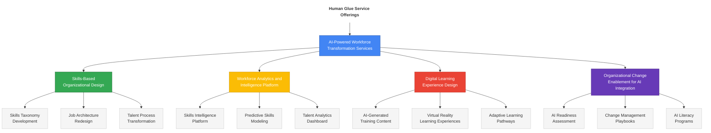
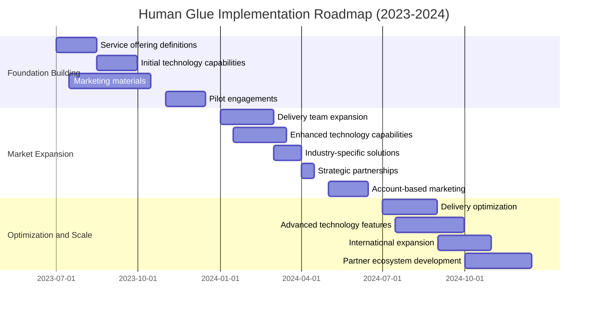
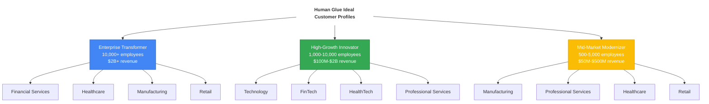

# Human Glue Documentation

  
  <h2>AI-Powered Organizational Development Solutions</h2>
  
<em>Connecting people and technology to transform organizations</em>

  

## 🌟 Project Overview

Human Glue is developing a comprehensive suite of AI-powered organizational development solutions to address the challenges of the rapidly evolving workplace. Our mission is to reset the value equation between organizations and employees, enabling both to thrive in an era of technological disruption and changing work paradigms.

Led by CEO Alex Schwartz and CTO Matty Squarzoni, Human Glue combines cutting-edge AI technology with deep organizational development expertise to deliver transformative solutions for enterprises navigating workforce transformation.

  <table>
    <tr>
      <td align="center">
        
         <strong>Alex Schwartz</strong>
         Chief Executive Officer
      </td>
      <td align="center">
        
         <strong>Matty Squarzoni</strong>
         Chief Technology Officer
      </td>
    </tr>
  </table>

## 📊 Key Service Offerings

## 📚 Documentation Site Map

### 1. Overview
- [Executive Summary](human_glue/overview/executive_summary.md)
- [Future of Work](human_glue/overview/future_of_work.md)
- [Value Proposition](human_glue/overview/value_proposition.md)
- [Product Vision](human_glue/overview/product_vision.md)

### 2. Business Strategy
- [Profitable Services 2025](human_glue/business_strategy/profitable_services_2025.md)
- [AI Workforce Transformation Case Study](human_glue/business_strategy/ai_workforce_transformation_case_study.md)
- [Service Pricing Model](human_glue/business_strategy/service_pricing_model.md)
- [Technology Investment Roadmap](human_glue/business_strategy/technology_investment_roadmap.md)
- [Market Analysis 2025](human_glue/business_strategy/market_analysis_2025.md)
- [Implementation Roadmap](human_glue/business_strategy/implementation_roadmap.md)

### 3. Competitive Landscape
- [AI Assessment Tools](human_glue/competitive_landscape/ai_assessment_tools.md)
- [Competitor Analysis](human_glue/competitive_landscape/competitor_analysis.md)
- [Detailed Competitor Analysis](human_glue/competitive_landscape/detailed_competitor_analysis.md)
- [Go to Market Strategy](human_glue/competitive_landscape/go_to_market_strategy.md)

### 4. Assessment Tool
- [Technical Specification](human_glue/assessment_tool/technical_specification.md)
- [User Experience Design](human_glue/assessment_tool/user_experience_design.md)
- [Data Model](human_glue/assessment_tool/data_model.md)
- [AI Capabilities](human_glue/assessment_tool/ai_capabilities.md)

### 5. Workshops
- [Workshop Methodology](human_glue/workshops/workshop_methodology.md)
- [Facilitator Guide](human_glue/workshops/facilitator_guide.md)
- [Workshop Materials](human_glue/workshops/workshop_materials.md)

### 6. Toolbox
- [Toolbox Components](human_glue/toolbox/toolbox_components.md)
- [Implementation Guide](human_glue/toolbox/implementation_guide.md)
- [Case Studies](human_glue/toolbox/case_studies.md)

### 7. Sales Strategy
- [Target Account Example](human_glue/sales_strategy/target_account_example.md)
- [Sales Playbook](human_glue/sales_strategy/sales_playbook.md)
- [ROI Calculator](human_glue/sales_strategy/roi_calculator.md)

### 8. Customer Research
- [Research Methodology](human_glue/customer_research/research_methodology.md)
- [Interview Findings](human_glue/customer_research/interview_findings.md)
- [Survey Results](human_glue/customer_research/survey_results.md)

## 📅 Implementation Timeline

## 🎯 Ideal Customer Profiles

## 📚 Key References

Our approach is informed by the latest research and industry insights:

1. World Economic Forum. (2023). "The Future of Jobs Report 2023." Retrieved from https://www3.weforum.org/docs/WEF_Future_of_Jobs_2023.pdf

2. McKinsey & Company. (2023). "Superagency in the workplace: Empowering people to unlock AI's full potential." Retrieved from https://www.mckinsey.com/capabilities/mckinsey-digital/our-insights/superagency-in-the-workplace-empowering-people-to-unlock-ais-full-potential-at-work

3. Deloitte. (2023). "2023 Global Human Capital Trends: New fundamentals for a boundaryless world." Retrieved from https://www2.deloitte.com/us/en/insights/focus/human-capital-trends.html

4. Gartner. (2023). "Market Guide for Workforce Management Applications." Retrieved from https://www.gartner.com/doc/reprints?id=1-2EZH3KWR&ct=230913&st=sb

## 📞 Contact Information

For more information about Human Glue and our services, please contact:

**Alex Schwartz**, CEO  
Email: alex@humanglue.ai  
Phone: (555) 123-4567

**Matty Squarzoni**, CTO  
Email: matty@humanglue.ai  
Phone: (555) 765-4321

---

  
© 2023-2024 Human Glue. All rights reserved.

 