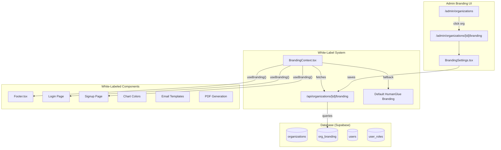
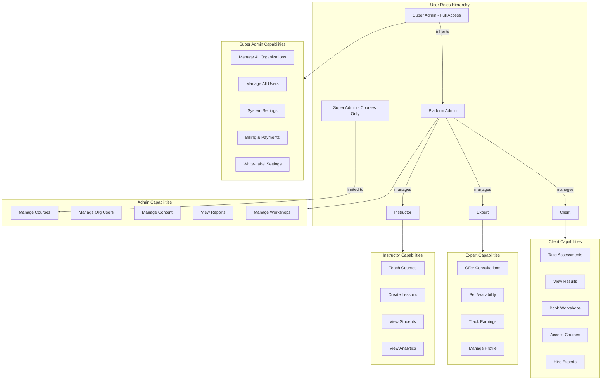
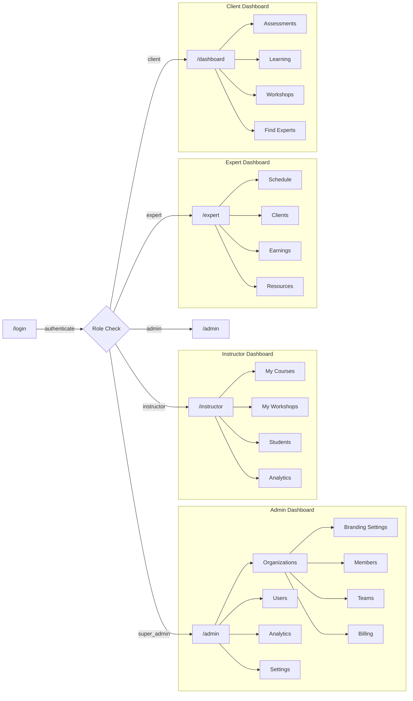
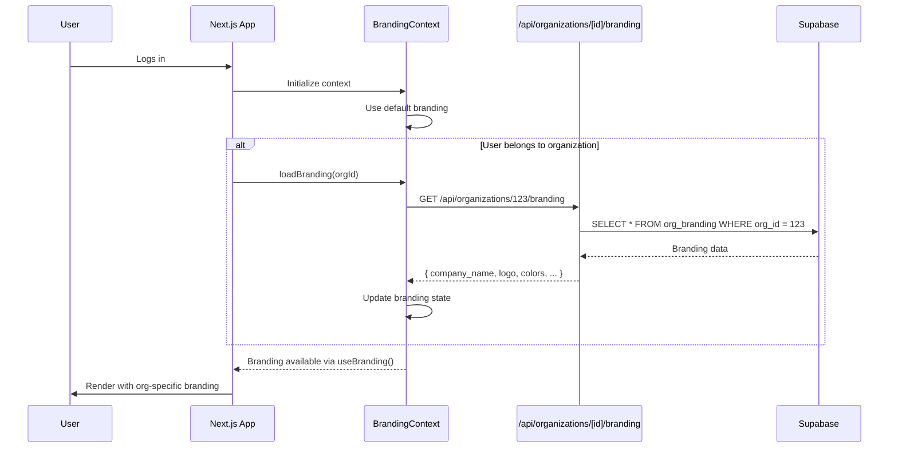
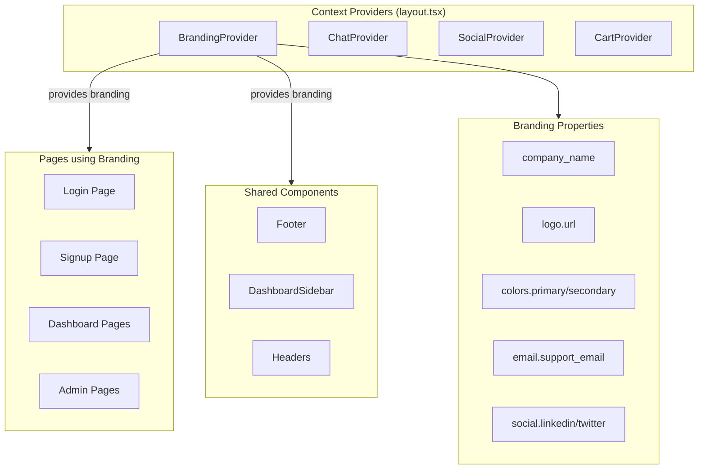

# HumanGlue Platform Architecture

## White-Label System & User Roles

```mermaid
flowchart TB
    subgraph Database["Database (Supabase)"]
        OrgTable[(organizations)]
        BrandingTable[(org_branding)]
        UsersTable[(users)]
        RolesTable[(user_roles)]
    end

    subgraph BrandingSystem["White-Label System"]
        BC[BrandingContext.tsx]
        API["/api/organizations/[id]/branding"]
        DefaultBrand[Default HumanGlue Branding]

        BC --> |"fetches"| API
        API --> |"queries"| BrandingTable
        BC --> |"fallback"| DefaultBrand
    end

    subgraph Components["White-Labeled Components"]
        Footer[Footer.tsx]
        Login[Login Page]
        Signup[Signup Page]
        Charts[Chart Colors]
        Emails[Email Templates]
        PDFs[PDF Generation]
    end

    BC --> |"useBranding()"| Footer
    BC --> |"useBranding()"| Login
    BC --> |"useBranding()"| Signup

    subgraph AdminUI["Admin Branding UI"]
        OrgList["/admin/organizations"]
        BrandSettings["/admin/organizations/[id]/branding"]
        BrandForm[BrandingSettings.tsx]
    end

    OrgList --> |"click org"| BrandSettings
    BrandSettings --> BrandForm
    BrandForm --> |"saves"| API
```

## User Roles & Permissions

```mermaid
flowchart TB
    subgraph Roles["User Roles Hierarchy"]
        SA[Super Admin - Full Access]
        SAC[Super Admin - Courses Only]
        Admin[Platform Admin]
        Instructor[Instructor]
        Expert[Expert]
        Client[Client]
    end

    SA --> |"inherits"| Admin
    SAC --> |"limited to"| Courses
    Admin --> |"manages"| Instructor
    Admin --> |"manages"| Expert
    Admin --> |"manages"| Client

    subgraph SuperAdminCaps["Super Admin Capabilities"]
        AllOrgs[Manage All Organizations]
        AllUsers[Manage All Users]
        SystemSettings[System Settings]
        Billing[Billing & Payments]
        Branding[White-Label Settings]
    end

    subgraph AdminCaps["Admin Capabilities"]
        OrgUsers[Manage Org Users]
        Content[Manage Content]
        Reports[View Reports]
        Workshops[Manage Workshops]
        Courses[Manage Courses]
    end

    subgraph InstructorCaps["Instructor Capabilities"]
        TeachCourses[Teach Courses]
        CreateLessons[Create Lessons]
        ViewStudents[View Students]
        InstructorAnalytics[View Analytics]
    end

    subgraph ExpertCaps["Expert Capabilities"]
        Consultations[Offer Consultations]
        Availability[Set Availability]
        Earnings[Track Earnings]
        ExpertProfile[Manage Profile]
    end

    subgraph ClientCaps["Client Capabilities"]
        TakeAssessments[Take Assessments]
        ViewResults[View Results]
        BookWorkshops[Book Workshops]
        AccessCourses[Access Courses]
        HireExperts[Hire Experts]
    end

    SA --> SuperAdminCaps
    Admin --> AdminCaps
    Instructor --> InstructorCaps
    Expert --> ExpertCaps
    Client --> ClientCaps
```

## Dashboard Navigation Flow

```mermaid
flowchart LR
    Login["/login"] --> |"authenticate"| Router{Role Check}

    Router --> |"super_admin"| SuperDash["/admin"]
    Router --> |"admin"| AdminDash["/admin"]
    Router --> |"instructor"| InstructorDash["/instructor"]
    Router --> |"expert"| ExpertDash["/expert"]
    Router --> |"client"| ClientDash["/dashboard"]

    subgraph AdminPages["Admin Dashboard"]
        SuperDash --> OrgMgmt[Organizations]
        SuperDash --> UserMgmt[Users]
        SuperDash --> Analytics[Analytics]
        SuperDash --> Settings[Settings]
        OrgMgmt --> BrandingPage[Branding Settings]
        OrgMgmt --> Members[Members]
        OrgMgmt --> Teams[Teams]
        OrgMgmt --> OrgBilling[Billing]
    end

    subgraph InstructorPages["Instructor Dashboard"]
        InstructorDash --> MyCourses[My Courses]
        InstructorDash --> MyWorkshops[My Workshops]
        InstructorDash --> Students[Students]
        InstructorDash --> InstAnalytics[Analytics]
    end

    subgraph ExpertPages["Expert Dashboard"]
        ExpertDash --> Schedule[Schedule]
        ExpertDash --> Clients[Clients]
        ExpertDash --> ExpertEarnings[Earnings]
        ExpertDash --> Resources[Resources]
    end

    subgraph ClientPages["Client Dashboard"]
        ClientDash --> Assessments[Assessments]
        ClientDash --> Learning[Learning]
        ClientDash --> ClientWorkshops[Workshops]
        ClientDash --> Talent[Find Experts]
    end
```

## White-Label Data Flow

```mermaid
sequenceDiagram
    participant User
    participant App as Next.js App
    participant BC as BrandingContext
    participant API as /api/organizations/[id]/branding
    participant DB as Supabase

    User->>App: Logs in
    App->>BC: Initialize context
    BC->>BC: Use default branding

    alt User belongs to organization
        App->>BC: loadBranding(orgId)
        BC->>API: GET /api/organizations/123/branding
        API->>DB: SELECT * FROM org_branding WHERE org_id = 123
        DB-->>API: Branding data
        API-->>BC: { company_name, logo, colors, ... }
        BC->>BC: Update branding state
    end

    BC-->>App: Branding available via useBranding()
    App->>User: Render with org-specific branding
```

## Component Hierarchy

```mermaid
flowchart TB
    subgraph Providers["Context Providers (layout.tsx)"]
        BP[BrandingProvider]
        CP[ChatProvider]
        SP[SocialProvider]
        CartP[CartProvider]
    end

    subgraph Pages["Pages using Branding"]
        LP[Login Page]
        SP2[Signup Page]
        DP[Dashboard Pages]
        AP[Admin Pages]
    end

    subgraph SharedComponents["Shared Components"]
        Footer[Footer]
        Sidebar[DashboardSidebar]
        Header[Headers]
    end

    BP --> |"provides branding"| Pages
    BP --> |"provides branding"| SharedComponents

    subgraph BrandingData["Branding Properties"]
        CN[company_name]
        Logo[logo.url]
        Colors[colors.primary/secondary]
        Email[email.support_email]
        Social[social.linkedin/twitter]
    end

    BP --> BrandingData
```
