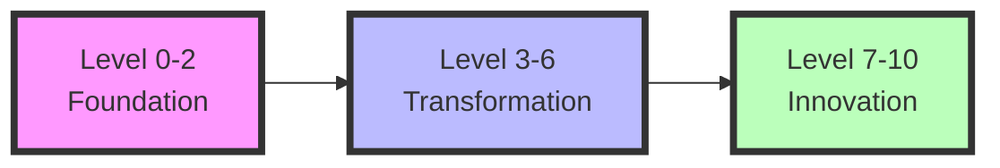
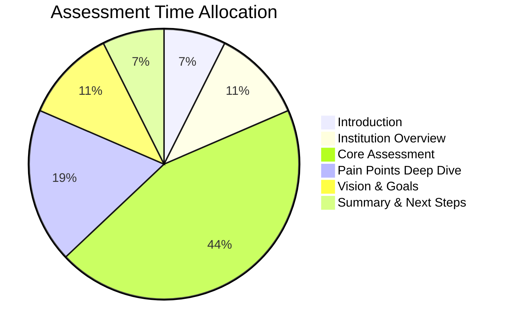

# 🎓 HumanGlue Education AI Maturity Assessment

> **Transform Your Institution from Traditional Teaching to Transcendent Learning**

<aside>
💡 **Quick Navigation**
- [Executive Summary](#executive-summary)
- [The 10-Level Journey](#the-10-level-journey)
- [Assessment Framework](#assessment-framework)
- [ROI & Metrics](#roi-metrics)
- [Implementation Roadmap](#implementation-roadmap)
- [Success Stories](#success-stories)
- [Get Started](#get-started)
</aside>

---

## 🌟 Executive Summary

<aside>
🚀 **The Educational Imperative**

Education stands at an unprecedented crossroads. While AI transforms every industry, educational institutions lag dangerously behind. The gap between classroom reality and workplace demands widens daily.

**Yet within this challenge lies extraordinary opportunity.**
</aside>

### 📊 Key Statistics

| Metric | Current Reality | AI-Enabled Future |
|--------|----------------|-------------------|
| **Teacher Admin Time** | 20+ hrs/week | 5 hrs/week |
| **Student Engagement** | 45% | 85%+ |
| **Learning Speed** | 1x | 3-10x |
| **Achievement Gap** | 40% | <10% |
| **ROI** | N/A | 300-800% |

### 🎯 Our Solution

HumanGlue's Education AI Maturity Framework provides a clear, actionable roadmap specifically designed for educational institutions. This framework guides schools, universities, and training organizations through **10 transformative levels**.

<aside>
✨ **Core Differentiators**

1. **Education-First Design** - Built for pedagogical excellence
2. **Stakeholder-Centric** - Addresses all needs
3. **Equity-Focused** - No learner left behind
4. **Evidence-Based** - Real-world proven
5. **Future-Ready** - Prepares for AI world
</aside>

---

## 🪜 The 10-Level Journey

### 📈 Maturity Level Overview



### Level 0: Traditional Teaching 📚
> **Pre-Digital Education**

<aside>
📝 **Characteristics**
- Paper-based assignments
- Manual grading
- Traditional lectures
- Physical textbooks
- Face-to-face only
</aside>

**Key Metrics:**
- Technology budget: <1%
- Digital tool usage: <10%
- Grading turnaround: 1-2 weeks

### Level 1: Digital Foundations 💻
> **Basic Technology Adoption**

<aside>
🏗️ **Characteristics**
- LMS adoption
- Email communication
- Digital gradebooks
- Online resources
- Teacher experimentation
</aside>

**Milestone:** 50% of teachers using digital tools weekly
**Investment:** $50-100/student/year
**Tools:** Google Classroom, Canvas, Blackboard

### Level 2: AI Exploration 🤖
> **Communication & Basic Automation**

<aside>
⚡ **Characteristics**
- AI writing assistants
- Automated grading (MC)
- Plagiarism detection
- Grammar feedback
- Simple chatbots
</aside>

**Milestone:** 25% efficiency gain
**Investment:** $100-200/student/year
**Tools:** Grammarly, Turnitin, Google Forms

### Level 3: Intelligent Support 🧠
> **First Educational Agents**

<aside>
🎓 **Characteristics**
- AI tutoring
- Essay grading + feedback
- Predictive analytics
- Personalized recommendations
- AI content creation
</aside>

**Milestone:** 30% engagement improvement
**Investment:** $200-300/student/year
**Tools:** Khan Academy's Khanmigo, Duolingo, Gradescope

### Level 4: Collaborative Intelligence 🤝
> **Multi-Agent Learning Systems**

<aside>
🔄 **Characteristics**
- Integrated AI curriculum
- Virtual TAs per class
- Automated parent comms
- AI-driven PD
- Cross-functional analytics
</aside>

**Milestone:** 50% reduced admin workload
**Investment:** $300-400/student/year
**Tools:** Century Tech, IBM Watson Tutor, Civitas Learning

### Level 5: Department-Wide Intelligence 🏢
> **Full Area Transformation**

<aside>
🌐 **Characteristics**
- AI coordinates departments
- Automated curriculum mapping
- Real-time interventions
- Personalized paths for all
- AI special education
</aside>

**Milestone:** 40% outcome improvement
**Investment:** $400-500/student/year
**Tools:** Ellucian CRM, Brightspace Insights, Territorium

### Level 6: Institution Orchestration 🏛️
> **Cross-Functional AI**

<aside>
🔗 **Characteristics**
- Seamless K-12→Higher Ed
- AI resource optimization
- Predictive enrollment
- Automated compliance
- Institution-wide analytics
</aside>

**Milestone:** 60% efficiency improvement
**Investment:** $500-600/student/year
**Tools:** Watermark Suite, Anthology, Oracle Student Cloud

### Level 7: Strategic Intelligence 🚀
> **AI-Led Innovation**

<aside>
💡 **Characteristics**
- AI designs pedagogy
- Career pathway guidance
- Custom curricula generation
- Automated grant writing
- Global AI classrooms
</aside>

**Milestone:** 25% graduation rate increase
**Investment:** $600-800/student/year
**Systems:** Custom AI platforms

### Level 8: Creative Ecosystems 🎨
> **AI as Co-Creator**

<aside>
🌈 **Characteristics**
- Interactive simulations
- VR learning environments
- AI research assistants
- Content localization
- Consciousness-aware systems
</aside>

**Milestone:** 3x faster mastery
**Investment:** $800-1000/student/year
**Tech:** VR/AR, neural interfaces

### Level 9: Adaptive Networks 🧬
> **Self-Evolving Systems**

<aside>
🔮 **Characteristics**
- Real-time curriculum evolution
- Lifelong AI mentors
- Predictive skill development
- Global knowledge synthesis
- Quantum optimization
</aside>

**Milestone:** 90% personalized excellence
**Investment:** $1000-1500/student/year
**Systems:** AGI tutors, BCIs

### Level 10: Transcendent Learning ✨
> **Consciousness-Integrated Education**

<aside>
🌌 **Characteristics**
- Direct knowledge transfer
- Collective intelligence
- Reality-based simulations
- Unlimited personalization
- Post-human paradigms
</aside>

**Milestone:** Instantaneous learning
**Investment:** $1500+/student/year
**Tech:** Consciousness interfaces

---

## 🎯 Assessment Framework

### 📋 Assessment Components

<aside>
🔍 **6 Core Domains**

1. **Technology Infrastructure** (20%)
2. **Teaching & Learning Innovation** (25%)
3. **Administrative Efficiency** (15%)
4. **Stakeholder Engagement** (15%)
5. **AI Adoption & Innovation** (20%)
6. **Outcomes & Impact** (5%)
</aside>

### 🗣️ Meet Dr. Sarah Chen
> **Your AI Assessment Specialist**

<aside>
👩‍🏫 **Background**
- Ph.D. Educational Psychology, Stanford
- 15+ years in EdTech transformation
- K-12, Higher Ed, Corporate expertise
- Change management specialist
</aside>

**Assessment Approach:**
- Warm, empathetic, encouraging
- Psychology-informed techniques
- Student outcome focused
- Addresses AI concerns

### ⏱️ Assessment Structure (20-25 min)



---

## 💰 ROI & Metrics

### 📊 ROI Philosophy

<aside>
💡 **Educational ROI Formula**

ROI = (Financial Benefits + Learning Outcomes + Social Impact) / Total Investment
</aside>

### 📈 Returns by Level

| Level | Timeline | Typical ROI | Key Value Driver |
|-------|----------|-------------|------------------|
| 0-1 | 3-6 months | 50-100% | Efficiency gains |
| 2-3 | 6-12 months | 150-250% | Productivity boost |
| 4-5 | 12-24 months | 300-500% | Transformation |
| 6-7 | 2-3 years | 500-1000% | Innovation |
| 8-10 | 3-5+ years | 10x+ | Paradigm shift |

### 💵 Investment Guidelines

<aside>
💼 **By Institution Size**

**Small (<1K students)**
- Level 1-2: $50-100K/year
- Level 3-4: $100-300K/year
- Level 5+: $300K+/year

**Medium (1K-10K)**
- Level 1-2: $100K-1M/year
- Level 3-4: $1-3M/year
- Level 5+: $3M+/year

**Large (10K+)**
- Level 1-2: $1-5M/year
- Level 3-4: $5-15M/year
- Level 5+: $15M+/year
</aside>

### 🎯 Key Metrics

**Financial Metrics**
- Administrative cost reduction: 25-40%
- Teacher time savings: 10-20 hrs/week
- Dropout prevention: $10-50K/student
- Grant success: 40% improvement

**Educational Metrics**
- Learning outcomes: 40-60% improvement
- Achievement gap: 35% reduction
- Engagement: 50% increase
- Graduation rates: 25% improvement

**Strategic Metrics**
- Enrollment growth: 10-20%
- Teacher retention: 90%+
- Innovation index: Top 10%
- Market position: Premium tier

---

## 🗺️ Implementation Roadmap

### 📅 Phased Approach

```mermaid
gantt
    title AI Transformation Timeline
    dateFormat YYYY-MM-DD
    section Phase 1
    Discovery & Assessment    :2024-01-01, 14d
    Quick Wins               :14d, 60d
    section Phase 2
    Strategy & Planning      :14d, 30d
    Foundation Building      :30d, 60d
    section Phase 3
    Department Pilots        :60d, 90d
    Scale Success           :90d, 120d
    section Phase 4
    Full Transformation      :120d, 180d
    Innovation Leadership    :180d, 365d
```

### 🚀 Quick Start Actions

<aside>
⚡ **Week 1-2: Discovery**
- Current state evaluation
- Stakeholder surveys
- Infrastructure audit
- Quick win identification
</aside>

<aside>
📋 **Week 3-4: Planning**
- Custom roadmap
- Budget planning
- Change strategy
- Success metrics
</aside>

<aside>
🏗️ **Month 2-3: Foundation**
- Infrastructure upgrades
- Tool deployment
- Core training
- Pilot launch
</aside>

<aside>
📈 **Month 4-12: Scale**
- Phased rollout
- Continuous training
- Impact measurement
- Strategy refinement
</aside>

---

## 🏆 Success Stories

### 📚 Riverside Unified School District
> **Level 2→4 Transformation**

<aside>
📊 **Results**
- **Challenge:** 35% below grade level
- **Solution:** AI tutoring + predictive intervention
- **Outcome:** 68% improvement in 18 months
- **ROI:** $2.3M saved, 380% return
</aside>

### 🎓 State University System
> **Level 3→6 Transformation**

<aside>
📊 **Results**
- **Challenge:** 45% dropout rate
- **Solution:** AI success coaching
- **Outcome:** 72% retention rate
- **ROI:** $45M efficiency gains, 800% return
</aside>

### 💼 Global Corporate Academy
> **Level 4→8 Transformation**

<aside>
📊 **Results**
- **Challenge:** Rapid reskilling needs
- **Solution:** AI adaptive learning
- **Outcome:** 5x faster training
- **ROI:** $120M productivity gains
</aside>

---

## 🚀 Get Started

### 📞 Contact Our Education Team

<aside>
📧 **Reach Out Today**

**Email:** education@humanglue.ai
**Phone:** 1-800-LEARN-AI
**Web:** humanglue.ai/education
**Schedule:** humanglue.ai/education-consultation
</aside>

### 💎 Investment Options

<aside>
💼 **Assessment Package**
$15,000

✅ Comprehensive evaluation
✅ Interactive dashboard
✅ Executive readout
✅ Implementation roadmap
✅ ROI projections
</aside>

<aside>
🚀 **Quick Start Package**
$50,000

✅ Everything in Assessment
✅ 90-day quick wins
✅ Tool selection & setup
✅ Initial training
✅ Monthly reviews
</aside>

<aside>
🌟 **Transformation Partnership**
Custom Pricing

✅ Full implementation
✅ Dedicated success team
✅ Custom solutions
✅ Ongoing optimization
✅ Innovation lab access
</aside>

### 📝 Next Steps

1. **Schedule Executive Briefing** (30 min)
2. **Complete Assessment** (2 weeks)
3. **Review Results** (90 min)
4. **Launch Transformation** (Phased)
5. **Achieve Excellence** (Ongoing)

---

<aside>
🌟 **Transform your institution from traditional teaching to transcendent learning.**

Every student deserves an AI-enhanced education.
Every educator deserves AI-powered support.
Every institution deserves to thrive in the age of AI.

**Start your transformation journey today.**
</aside>

---

## 📚 Additional Resources

### 📖 Quick Links
- [Full Maturity Model Details](/education/education_ai_maturity_model.md)
- [ROI Calculator & Metrics](/education/education_roi_metrics.md)
- [Assessment Questions](/education/education_assessment_questions.md)
- [AI Tools by Level](/education/education_ai_tools_by_level.md)
- [Training Pathways](/education/education_training_pathways.md)

### 🎥 Demo & Resources
- **Dr. Sarah Chen Demo Call:** Call +14482286664
- **Assessment Script:** `npm run education-assessment`
- **Documentation:** `/education` folder

---

*© 2024 HumanGlue. Empowering Educational Excellence Through AI.*