# Instructor Dashboard Database ERD

## Entity Relationship Diagram

This document provides a visual representation of the database schema for the HumanGlue instructor dashboard.

---

## Core Entities Overview

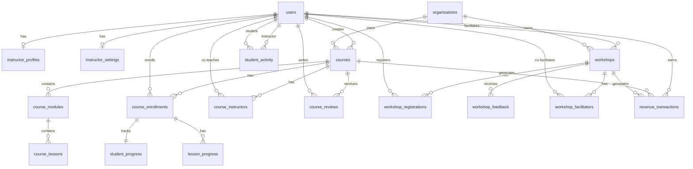

---

## Detailed Table Relationships

### Instructor Profile & Settings

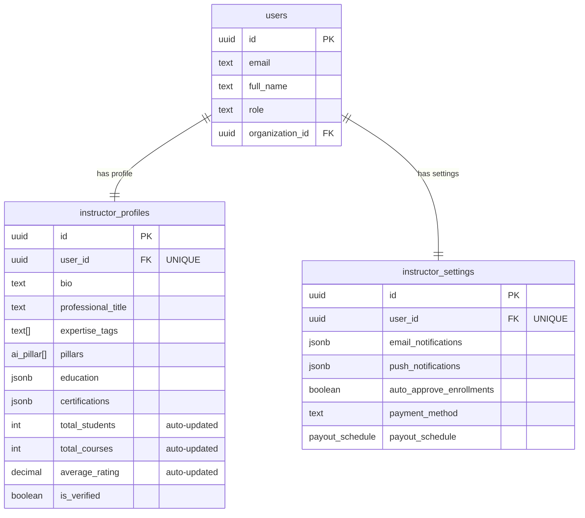

---

### Course Structure & Content

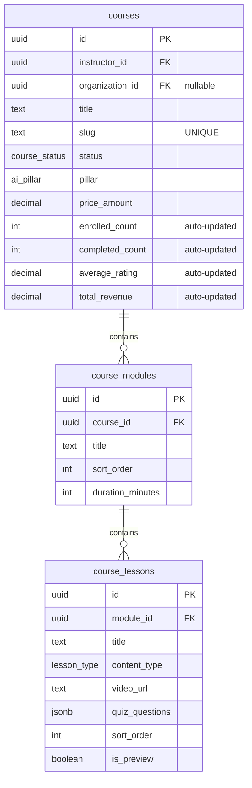

---

### Student Enrollment & Progress

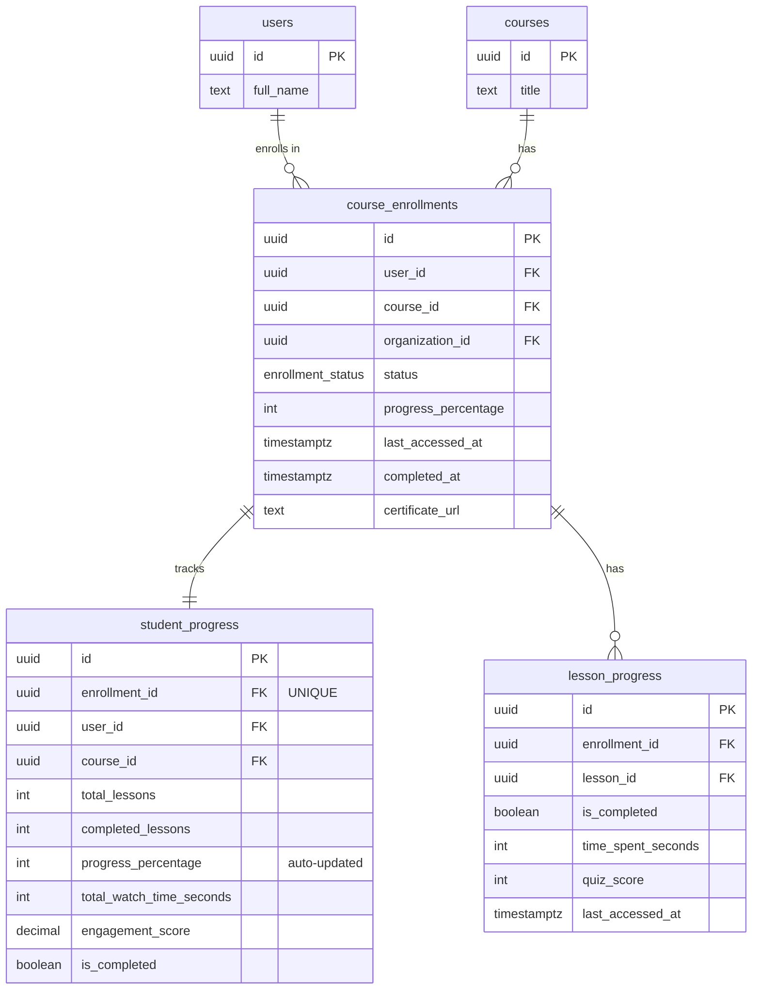

---

### Course Reviews & Ratings

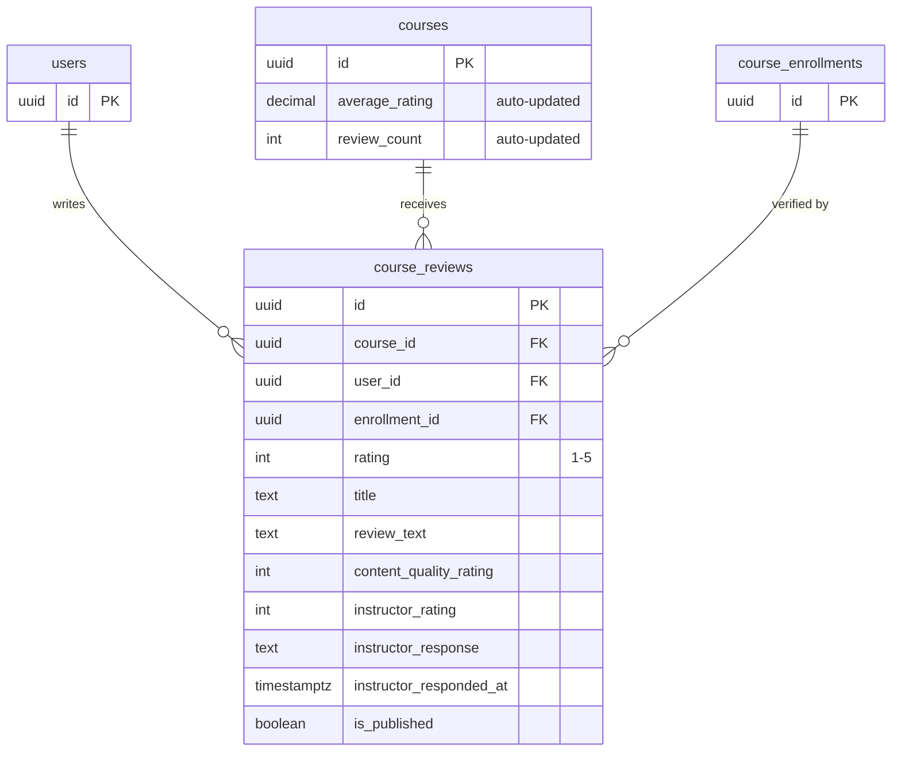

---

### Workshop Structure

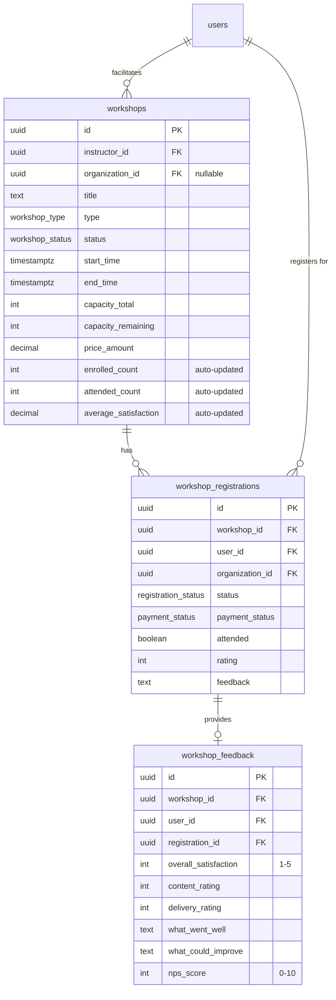

---

### Co-Teaching Relationships

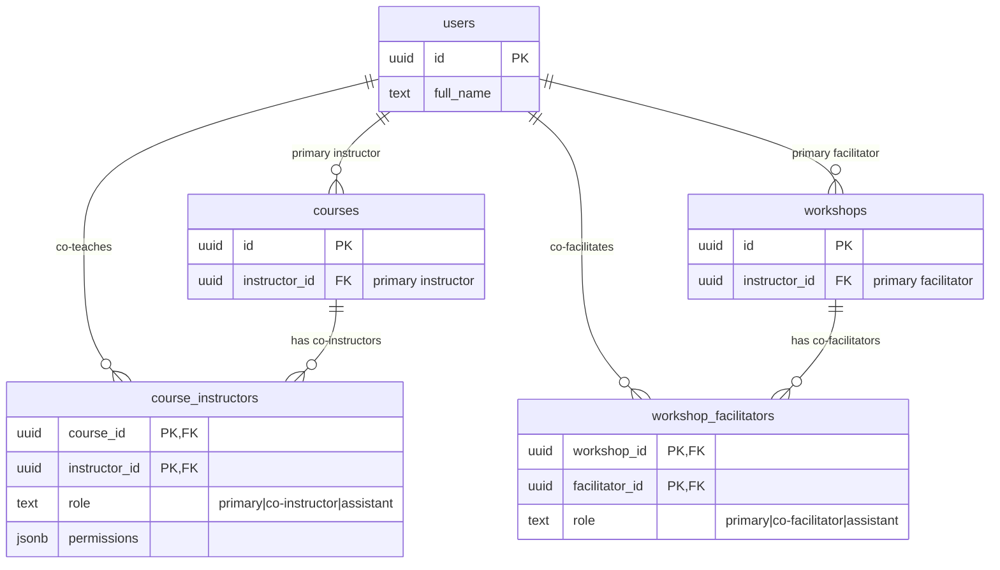

---

### Revenue & Transactions

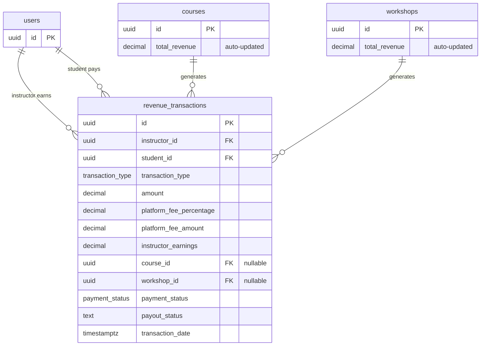

---

### Student Activity Timeline

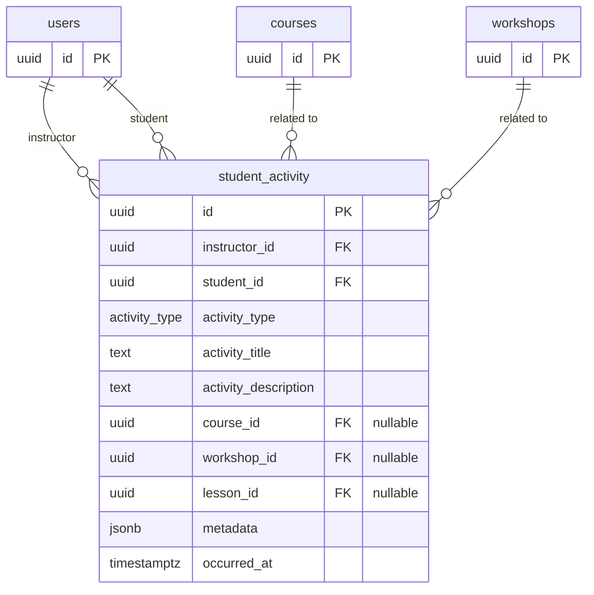

---

## Data Flow Diagrams

### Course Enrollment Flow

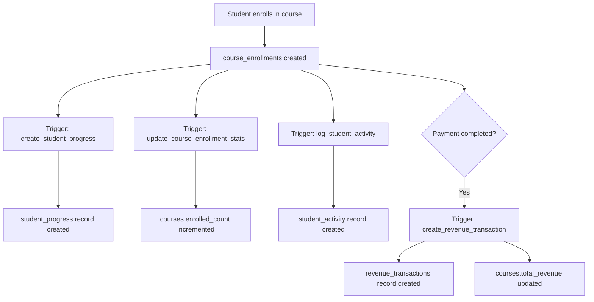

### Lesson Completion Flow

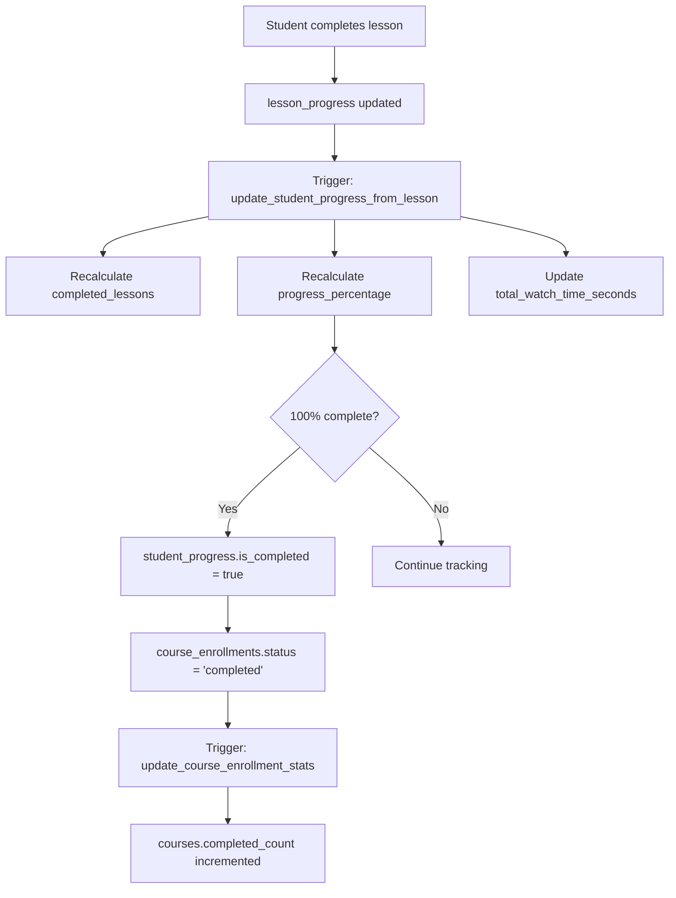

### Review Submission Flow

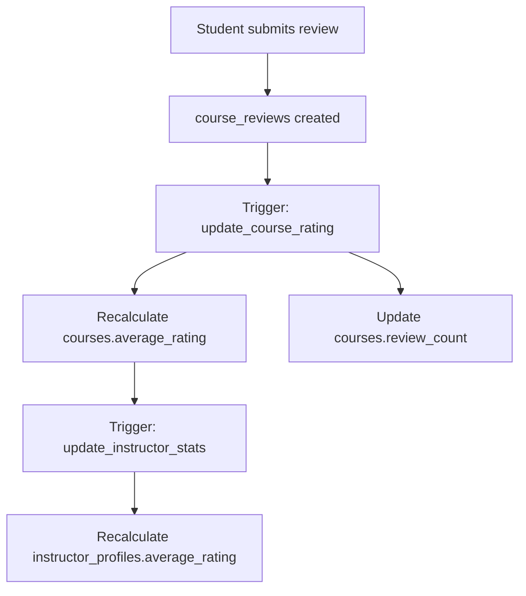

---

## Index Strategy Overview

### Primary Indexes (Foreign Keys)

All foreign key columns are indexed:
- `instructor_profiles.user_id`
- `courses.instructor_id`
- `courses.organization_id`
- `course_enrollments.user_id`
- `course_enrollments.course_id`
- `student_progress.enrollment_id`
- `revenue_transactions.instructor_id`
- etc.

### Composite Indexes (Multi-Column Queries)

For common query patterns:
```sql
-- Student progress by course + recent activity
(course_id, last_activity_at DESC)

-- Revenue by instructor + date range
(instructor_id, transaction_date DESC)

-- Activity timeline by instructor
(instructor_id, occurred_at DESC)
```

### Partial Indexes (Filtered Queries)

For status-based queries:
```sql
-- Only published courses
WHERE status = 'published'

-- Only upcoming workshops
WHERE status = 'published' AND start_time > now()

-- Only active enrollments
WHERE status IN ('enrolled', 'in_progress')
```

### GIN Indexes (Array/JSONB Fields)

For array and JSONB columns:
```sql
-- Search by expertise tags
instructor_profiles.expertise_tags

-- Search by course tags
courses.tags

-- Filter by pillars
instructor_profiles.pillars
```

---

## Multi-Tenant Architecture

### Data Isolation Pattern

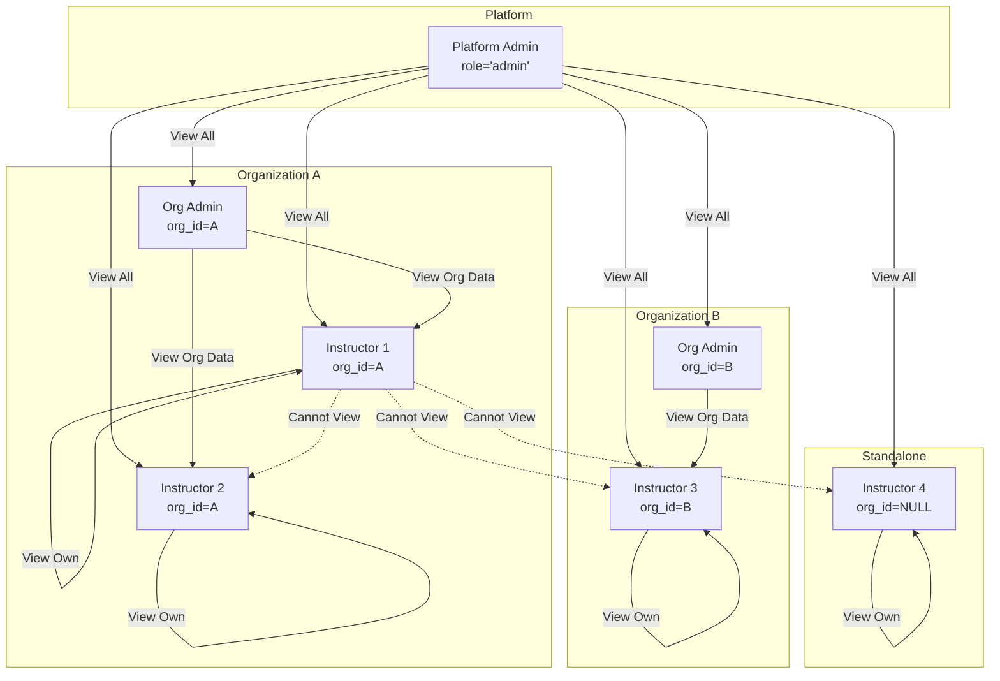

### RLS Policy Hierarchy

1. **Platform Admin** (role='admin')
   - Can view/manage ALL data
   - Bypasses organization checks

2. **Organization Admin** (role='org_admin')
   - Can view data where `organization_id = their_org_id`
   - Cannot view standalone instructors

3. **Instructor** (any user with courses/workshops)
   - Can view/manage where `instructor_id = auth.uid()`
   - Can view co-taught courses via `course_instructors` table
   - Organization admin can view their data if `organization_id` matches

4. **Student** (any user)
   - Can view/manage their own enrollments (`user_id = auth.uid()`)
   - Can view published courses/workshops

---

## Performance Considerations

### Query Optimization Tips

**Dashboard Overview** (expensive query):
```sql
-- Use helper function instead of multiple queries
SELECT * FROM get_instructor_dashboard_stats('instructor-id');

-- Function combines multiple aggregates efficiently
```

**Student List** (with sorting/filtering):
```sql
-- Use composite index on (course_id, last_activity_at)
SELECT * FROM student_progress
WHERE course_id = 'xxx'
ORDER BY last_activity_at DESC;
```

**Revenue Analytics** (date range queries):
```sql
-- Use composite index on (instructor_id, transaction_date)
SELECT * FROM revenue_transactions
WHERE instructor_id = 'xxx'
AND transaction_date BETWEEN '2025-01-01' AND '2025-12-31'
ORDER BY transaction_date DESC;
```

### Scalability Strategies

**Partitioning** (for large tables):
```sql
-- Partition student_activity by month
CREATE TABLE student_activity_2025_01 PARTITION OF student_activity
FOR VALUES FROM ('2025-01-01') TO ('2025-02-01');
```

**Materialized Views** (for expensive aggregations):
```sql
-- Pre-compute instructor stats (refresh daily)
CREATE MATERIALIZED VIEW instructor_monthly_revenue AS
SELECT
  instructor_id,
  DATE_TRUNC('month', transaction_date) AS month,
  SUM(instructor_earnings) AS total_earnings
FROM revenue_transactions
GROUP BY instructor_id, month;
```

**Connection Pooling** (Supabase):
- Use Supabase connection pooler for API routes
- Limit concurrent connections per instructor

---

## Summary

This ERD shows a comprehensive instructor dashboard schema with:

✅ **9 new tables** for instructor-specific features
✅ **Enhanced existing tables** (courses, workshops)
✅ **10+ triggers** for automatic stat updates
✅ **4 helper functions** for complex queries
✅ **30+ indexes** for query performance
✅ **Comprehensive RLS policies** for data isolation
✅ **Multi-tenant support** (standalone + org-linked)
✅ **Co-teaching support** (course_instructors, workshop_facilitators)
✅ **Revenue tracking** with platform fee calculations
✅ **Activity timeline** for student engagement

The schema is designed for:
- **Performance**: Strategic indexing, denormalized stats
- **Security**: RLS on every table, instructor isolation
- **Scalability**: Partitioning-ready, materialized views
- **Maintainability**: Clear relationships, comprehensive documentation
